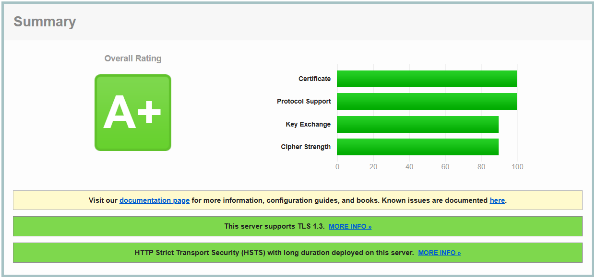

# 🎯 Matchsho

**Matchsho** is a web application designed to help university students find compatible roommates in dormitories. By collecting answers to a simple psychology-based test and personal living preferences, the system recommends the most compatible matches to enhance the shared dormitory experience and reduce potential conflicts.

---

## 🚀 Tech Stack

- **Frontend**: HTML, TailwindCSS, JavaScript  
- **Backend**: Python, FastAPI  
- **Database**: MySQL

---

## ✨ Features

- 🧠 **Smart Matchmaking** – Pairs students based on personality, lifestyle, and roommate preferences.
- 📝 **Custom Test System** – Includes a personalized questionnaire system to evaluate compatibility.
- 📊 **Clear Result Display** – Shows roommate compatibility scores and match reasoning.
- ⚙️ **Modern Tech Stack** – Built with FastAPI, vanilla JavaScript, TailwindCSS, and MySQL.
- 🌐 **Web-based UI** – Simple and responsive interface accessible from any device.
- 🔐 **Privacy Focused** – All data is stored securely and only accessible by admins.

---

## 💡📊 Try the Live Demo Now! 💡📊

Experience **Matchsho** in action! Click the link below to explore the platform and see how it helps students find their perfect roommates.  

# [🚀 **Go to Live Demo** 🚀](http://matchshoapp.ir)

> 🌟 **Tip:** Fill out the short personality test and discover your most compatible dorm mates instantly!

---

## 🚀 Deployment on Linux Server
Follow these steps to deploy Matchsho on a Linux server (e.g., with SSH access).

### 🔧 Prerequisites

- SSH access to the server
- Python 3.11+ installed on the server
- MySQL Server on the host
- Git installed on the server

### 📥 Clone the Repository

```bash
git clone https://github.com/Ehsan24Elyasi/matchsho.git
cd matchsho/backend
```
### 🛠️ Setup
1. Create a virtual environment:

```bash
python3 -m venv venv
source venv/bin/activate
```

2. Install dependencies:
```bash
   pip install -r requirements.txt
```

3. Create a MySQL database (e.g., matchsho_db) and a user (e.g., matchsho_user) with a secure password.

4. Configure .env in the backend directory:
```bash
MYSQL_HOST=localhost
MYSQL_PORT=3306
MYSQL_USER=matchsho_user
MYSQL_PASSWORD=your_secure_password
MYSQL_DATABASE=matchsho_db
```
5. Create database tables:
```bash
python3 -c "from database import Base, engine; Base.metadata.create_all(bind=engine)"
```

## ▶️ Run the Application

1. Edit start.sh with the correct virtual environment path (e.g., /home/yourusername/venv/bin/activate):
```bash
#!/bin/bash
source /home/yourusername/venv/bin/activate
uvicorn main:app --host 0.0.0.0 --port 8000
```

2. Make it executable and run:
```bash
chmod +x start.sh
./start.sh  
```

3. (Optional) For continuous running, set up supervisor:
```bash
sudo apt update
sudo apt install supervisor
sudo nano /etc/supervisor/conf.d/matchsho.conf
```
Content:

```bash
[program:matchsho]
command=/home/yourusername/matchsho/backend/start.sh
directory=/home/yourusername/matchsho/backend
autostart=true
autorestart=true
```

Save and reload:
```bash
sudo supervisorctl reload
```


## 🌐 Access the Site
- Ensure port 8000 is open in the firewall (sudo ufw allow 8000).
- Configure the domain (e.g., yourdomain.com) to point to the backend directory.
- Open http://yourdomain.com:8000 in a browser.

---

## ⚙️ Installation & Running Locally

Follow these steps to run Matchsho on your local machine.

### 🔧 Prerequisites

- Python 3.10+
- MySQL Server
- Git
- Any modern browser (for frontend)

### 📥 Clone the Repository

```bash
git clone https://github.com/yourusername/matchsho.git
cd matchsho
```

### Backend Setup (FastAPI)

1. Create a virtual environment:
   ```bash
   python -m venv venv
   source venv/bin/activate  # Windows: venv\Scripts\activate
   ```

2. Install dependencies:
   ```bash
   pip install -r requirements.txt
   ```

3. Configure `.env` with your MySQL credentials.

4. Run the backend:
   ```bash
   uvicorn app.main:app --host 0.0.0.0 --port 8000 --reload
   ```

### Frontend Setup

- The frontend is a static site built with vanilla JavaScript.
- You can open `index.html` directly in your browser or serve it locally:

```bash
cd frontend
python -m http.server 8080
```

Open your browser at `http://localhost:8080`.

---

## 🧗 Challenges Faced

During the development of Matchsho, these were some of the main challenges:

### 1. 🧠 Designing the Matching Algorithm
Creating a system that accurately matches students based on a set of subjective inputs (like cleanliness, bedtime, sociability) required trial and error. We iterated over various scoring strategies before settling on a weighted comparison model.

### 2. 🔗 Connecting Vanilla JS to an API  
Since we didn’t use a frontend framework, working with async APIs and handling loading states manually in JavaScript added extra effort and complexity.

### 3. 🧵 CORS & Backend Connectivity  
Integrating the frontend with FastAPI required proper CORS configuration and consistent API route design.


### 4. 🧪 Handling Test Results  
Displaying and interpreting the personality/compatibility test results required several design iterations to make the results understandable and meaningful for students.

### 5. 🔒 Respecting User Privacy  
Even though this is a student project, user data privacy was important. We avoided storing unnecessary raw answers and made sure data was only accessible by authorized users.


---

## 🛤️ Roadmap

Here are some planned features and improvements for future versions of Matchsho:

- [ ] Add real-time chat functionality between matched roommates.
- [ ] Develop a mobile app version for easier access.
- [ ] Improve the matching algorithm with machine learning techniques.
- [ ] Add multi-language support to cater to international students.
- [ ] Implement user authentication and profile management.
- [ ] Enable admins to manage test questions and view analytics dashboards.
- [ ] Enhance accessibility compliance and UI/UX refinements.

---

## 🔒 MatchSho HTTPS Security Overview (A+ Rating)

Check out our website's **security status**! 👀  
We are using **TLS 1.3** 🚀 and have **HSTS** enabled for maximum protection. 🛡️  



✅ **Overall Rating:** A+  
✅ **Protocol Support:** TLS 1.3  
✅ **Key Exchange & Cipher Strength:** Secure & Modern  

---

## 📞 Contact

If you have any questions, suggestions, or want to contribute, feel free to reach out:

- **Email:** ehsane8224pc@gmail.com  
- **LinkedIn:** [linkedin.com/in/ehsan-elyasi](https://linkedin.com/in/ehsan-elyasi)  
- **GitHub:** [github.com/Ehsan24Elyasi](https://github.com/Ehsan24Elyasi)

---

## 📄 License

This project is licensed under the MIT License. See the [LICENSE](LICENSE%20.txt) file for details.

---

## 🙏 Acknowledgments

Special thanks to all students and mentors who provided valuable feedback and support during the development of this project.  
Also, thanks to the open-source community and the creators of FastAPI, TailwindCSS, and other tools used here.

---

